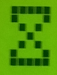

# lcd-hd44780
MCU-independent LCD driver for the common HD44780 and its ubiquitous clones.

## Setup
Reading the display data is not supported, that way RW can be tied to GND
and one can directly drive E, RS, D7-D4 with a 3.3V MCU

Before including the library, define theese three words.
You can also check out the [demo file](demo.4th) for a simple implementation.
1. `lcd-nibble ( x -- )` send a nibble to the LCD (set D7-D4 and strobe E)
2. `lcd-mode-data ( -- )` data mode (clear RS)
3. `lcd-mode-cmd  ( -- )` data mode (set RS)

Once the required words are defined and the library is included,
using it is as easy as typing the following:
```
-1 lcd-init
lcd( Hi there!)
```

## Usage / Words
### `lcd-emit ( x -- )`
send byte to display

**Example** Show 'A': `CHAR A lcd-emit`

### `lcd-cmd ( x -- )`
send command to display
(used by subsequent `lcd-*` words)

### `lcd-clear ( -- )`
clear display content

### `lcd-home ( -- )`
move cursor to home position

### `lcd-entry-mode ( f-I/D f-S -- )`
I/D=1 increment or I/D=0 decrement address after write,

S=1 shift entire display to I/D direction

**Example** Increment on store, do not shift `-1 0 lcd-entry-mode`

### `lcd-display-control ( f-D f-C f-B -- )`
D=1 display on, D=0 off

C=1 cursor  on, C=0 off

B=1 cursor blink on, B=0 off

**Example** disable display: `0 0 0 lcd-display-control`

**Example** enable display, show non-blinking cursor: `-1 -1 0 lcd-display-control`

### `lcd-c/d-shift ( f-S/C f-R/L -- )`
S/C=1 display shift, S/C=0 cursor shift

R/L=1 to the right, R/L=0 to the left

### `lcd-function-set ( f-DL f-N f-F -- )`
DL=1 8 bit, DL=0 4 bit data length

N=1 2 lines, N=0 1 line

F=1 5x10 dots, F=0 5x8 fots

### `lcd-cgram ( u-addr -- )`
set Character Generator RAM address
(used to handle custom characters, see `lcd-char`)

### `lcd-ddram ( u-addr -- )`
set Display Data RAM address
(sets the cursor position)

**Example** go to 2nd line on a 2-line display or 3rd line on a 4-line display: `$40 lcd-ddram`

*Hint:* A 2-line display has the 1st line at DDRAM `$00`, the 2nd at `$40`.
A 4-line display has the 1st line at DDRAM `$00`, 2nd at `$20`, 3rd at `$40`, 4th at `$60`.

### `lcd-init ( f-lines -- )`
initialize 4 bit interface

**Example** Initialize a multi-line LCD: `-1 lcd-init`

### `lcd-type ( c-addr n -- )`
send string to display

**Example** `s" text" lcd-type`

### `lcd( ( -- )`
like `.(` but send to lcd

**Example** `lcd( Forth rocks)`

### `lcd" ( -- )`
like `."` but send to lcd

**Example** `: hi lcd" Hello" ;`

### `lcd. ( -- )`
number output

**Example** `42 lcd.`

### `lcd-char ( c-addr u-char -- )`
Define a custom character, `c-addr` points to an address containing 8 consecutive pattern codes.
`u-char` must be between \[0,7\].



**Example** Hourglass as custom character 4:
```
\ each byte represents a line starting from top to bottom
create hourglass-data $1F c, $11 c, $0A c, $04 c, $0A c, $11 c, $1F c, $00 c,
\ send custom character to LCD
hourglass-data 4 lcd-char
\ display the character at the current DDRAM-position
4 lcd-emit
```

